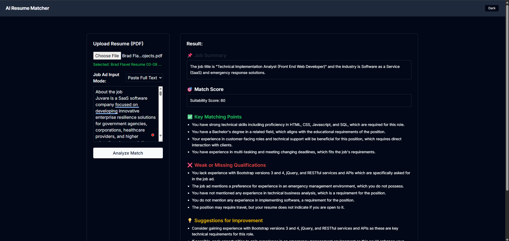
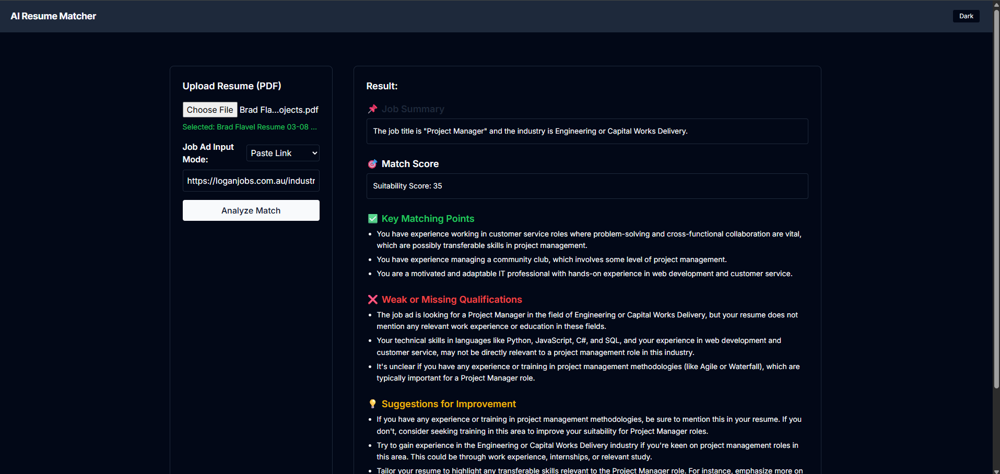
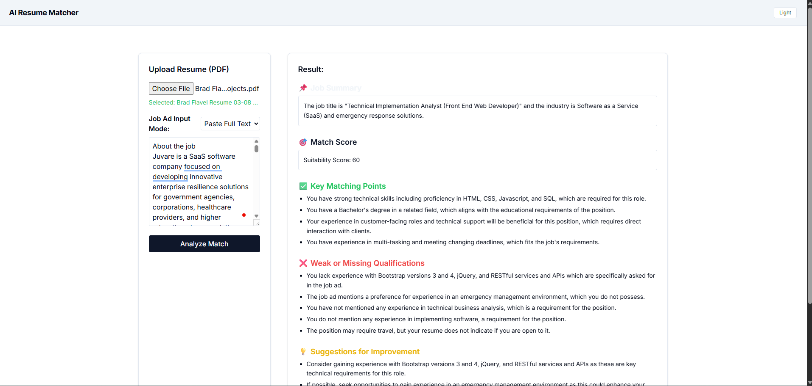

# AI Resume Matcher

[](https://github.com/bradflavel/ai-resume-matcher/actions/workflows/ci.yml)

A tool that compares a resume PDF against a job ad and returns a suitability score, matching points, weaknesses, and improvement suggestions. React + Tailwind frontend, Node + Express backend, OpenAI for the analysis.

[Live demo](https://bradflavel.github.io/ai-resume-matcher/) (backend on Render).

---

## Features

- Upload a resume PDF (first ~6,000 characters are processed)
- Paste a job ad URL (server fetches the page) or paste the full text directly
- Suitability score (0 to 100), matching points, weaknesses, and improvement suggestions
- Light and dark theme with system-preference detection
- Backend safeguards: API rate limiting, SSRF protection on URL fetches, 10 MB upload cap, PDF-only filter
- User-facing error toasts for failed requests

---

## Tech stack

- **Frontend:** React, Tailwind CSS, Axios, React Toastify, Vite
- **Backend:** Node.js, Express, Multer, pdf-parse, express-rate-limit, Helmet
- **AI:** OpenAI API (model configurable via `OPENAI_MODEL`)
- **Tests:** Vitest on both sides, Supertest for the server, React Testing Library for the client
- **CI:** GitHub Actions (lint, test, coverage, build)

---

## Project structure

```
ai-resume-matcher/
├── client/              React + Tailwind frontend
│   └── src/
│       ├── App.jsx
│       ├── StructuredResult.jsx
│       └── main.jsx
├── server/              Node.js + Express backend
│   └── index.js
└── .github/workflows/   CI pipeline
```

---

## Local development

### Backend

```bash
git clone https://github.com/bradflavel/ai-resume-matcher.git
cd ai-resume-matcher/server
npm install
# create a .env with at minimum:
#   OPENAI_API_KEY=sk-...
#   ALLOWED_ORIGINS=http://localhost:5173
npm start
```

### Frontend

```bash
cd ../client
npm install
npm run dev
```

The client runs on http://localhost:5173 and talks to http://localhost:3001 by default. Set `VITE_API_URL` to point at a different backend.

---

## API

Single endpoint. Multipart form upload in, validated JSON out.

**`POST /api/match-pdf-url`** — `multipart/form-data`

| field        | type           | notes                                          |
| ------------ | -------------- | ---------------------------------------------- |
| `resume`     | PDF file       | required, 10 MB max, `application/pdf` only    |
| `inputMode`  | string         | `"link"` or `"text"`                           |
| `jobAdUrl`   | string         | required when `inputMode` is `"link"`          |
| `jobAdText`  | string         | required when `inputMode` is `"text"`          |

**200 response** (validated server-side with [zod](https://zod.dev)):

```json
{
  "score": 82,
  "matches": ["...", "..."],
  "weaknesses": ["...", "..."],
  "suggestions": ["...", "..."]
}
```

The model is constrained by OpenAI's structured outputs feature (`response_format: json_schema`, strict mode), so the JSON shape is enforced at generation time, then re-validated on the server as a safety net.

**Error responses**

| status | when                                                         |
| ------ | ------------------------------------------------------------ |
| 400    | missing field, non-PDF upload, invalid or blocked URL, non-HTML fetch |
| 413    | PDF larger than 10 MB                                        |
| 429    | rate limit exceeded (5 requests per hour per IP in production) |
| 502    | AI provider error, malformed JSON, or output failed schema validation |

Error bodies are shaped as `{ "error": "human-readable message" }` with provider details stripped.

**Health checks:** `GET /` returns `OK`, `GET /healthz` returns `{ "status": "ok" }`.

---

## Testing

Both projects use Vitest with coverage thresholds enforced in CI.

```bash
# from either the server/ or client/ directory
npm test             # run the suite once
npm run test:watch   # watch mode
npm run coverage     # run with coverage report and threshold check
```

**What's covered:**

- **Server (26 tests):** full HTTP integration tests for `/api/match-pdf-url` and the health endpoints, covering the happy path, input validation, SSRF guards (localhost, private ranges, DNS-resolved private IPs, cloud metadata endpoints), upload size and MIME rejection, URL fetch behavior, and OpenAI error handling.
- **Client (26 tests):** unit tests for the StructuredResult parser and render output, plus component tests for the App form, theme toggle, file upload, and submission flow.

**Coverage gates enforced by CI:**

|          | Statements | Branches | Functions | Lines |
| -------- | ---------- | -------- | --------- | ----- |
| Server   | 85%        | 75%      | 85%       | 85%   |
| Client   | 90%        | 80%      | 85%       | 90%   |

---

## Screenshots





---

## Future improvements

- Save analysis history for comparison over time
- Auto-generate tailored resume bullet points
- Multi-language support
- Export results as PDF or DOCX

---

## License

MIT License

Permission is hereby granted, free of charge, to any person obtaining a copy
of this software and associated documentation files (the "Software"), to deal
in the Software without restriction, including without limitation the rights
to use, copy, modify, merge, publish, distribute, sublicense, and/or sell
copies of the Software, and to permit persons to whom the Software is
furnished to do so, subject to the following conditions:

The above copyright notice and this permission notice shall be included in
all copies or substantial portions of the Software.

THE SOFTWARE IS PROVIDED "AS IS", WITHOUT WARRANTY OF ANY KIND, EXPRESS OR
IMPLIED, INCLUDING BUT NOT LIMITED TO THE WARRANTIES OF MERCHANTABILITY,
FITNESS FOR A PARTICULAR PURPOSE AND NONINFRINGEMENT. IN NO EVENT SHALL THE
AUTHORS OR COPYRIGHT HOLDERS BE LIABLE FOR ANY CLAIM, DAMAGES OR OTHER
LIABILITY, WHETHER IN AN ACTION OF CONTRACT, TORT OR OTHERWISE, ARISING FROM,
OUT OF OR IN CONNECTION WITH THE SOFTWARE OR THE USE OR OTHER DEALINGS IN
THE SOFTWARE.

---

## Contact

[LinkedIn](https://www.linkedin.com/in/brad-f-643079b5)
