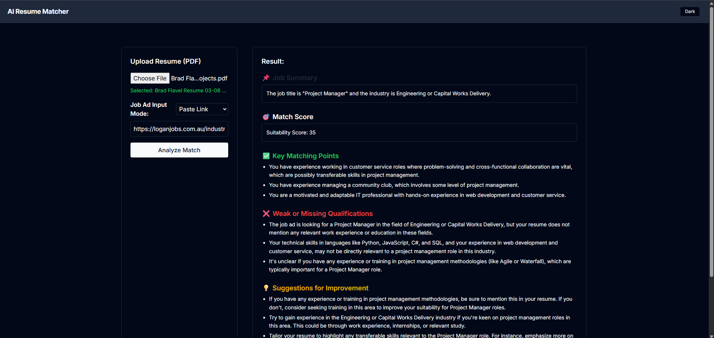

# 🤖 AI Resume Matcher  

A smart, themeable, client-side & server-powered tool that compares your resume against a job ad — giving you a suitability score, matching points, weaknesses, and actionable improvement tips.  
Built with **React + Tailwind CSS** for the front end, and a lightweight **Node.js + Express** API powered by **OpenAI GPT** for intelligent analysis.  

<br>

---

## 🚀 Features  

- 📄 Resume Upload (PDF) — via file input (first ~6,000 chars processed)  
- 🔗 Job Ad Input Options:  
  - Paste URL (fetches ad text)  
  - Paste full job ad text directly  
- 🎯 AI-Powered Match Analysis — Generates:  
  - Suitability Score (0–100)  
  - Key Matching Points  
  - Weak or Missing Qualifications  
  - Suggestions for Improvement  
- 🖥 Structured Output View — Results parsed and displayed in clean sections  
- 🎨 Theme toggle (light/dark) with preference respected  
- ⚡ Fast, responsive UI (Tailwind)  
- 🔒 API rate limiting on backend  
- 🛠 Friendly error handling via toasts  

<br>

---

## 💡 Why I Built This  

Job seekers often guess whether a resume fits a role.  
This tool reads both the resume and the job ad, then tells you exactly where you stand — clearly and with actionable feedback.

Key design constraints:  
- Clear feedback: strengths, gaps, and concrete tips  
- Fast & modern UI: Tailwind + React  
- Secure API: request limiting and robust parsing

<br>

---

## 🛠️ Challenges & Solutions  

| Challenge | Solution |
|-----------|----------|
| Parsing PDFs reliably in Node. | Used pdf-parse to extract clean text from uploaded resumes. |
| Handling both job ad URLs and pasted text. | Two input modes; fetch HTML text for links or accept pasted text. |
| Keeping the UI readable with verbose AI output. | StructuredResult component parses GPT output into sections. |
| Theme reverting on reload. | Toggled html.dark based on system preference on first load. |
| Preventing spam & API abuse. | express-rate-limit middleware on /api. |

<br>

---

## 🖼️ Screenshots  

(Screenshots are stored in the images/ folder.)





<br>

---

## 🛠️ Tech Stack  

- Frontend: React, Tailwind CSS, Axios, React Toastify  
- Backend: Node.js, Express, Multer, pdf-parse, express-rate-limit  
- AI: OpenAI API (model configurable)  
- Build: Vite (frontend)  
- Hosting: Any static host for client + Node host for server

<br>

---

## 📁 Folder Structure  

📁 ai-resume-matcher/  
├── client/                     (React + Tailwind frontend)  
│   ├── src/  
│   │   ├── App.jsx  
│   │   ├── StructuredResult.jsx  
│   │   ├── index.css  
│   │   └── main.jsx  
│   └── ...  
├── server/                     (Node.js + Express backend)  
│   ├── index.js  
│   └── ...  
└── README.md

<br>

---

## 🔮 Future Improvements  

- 📊 Save Analysis History — Compare results over time  
- 📄 Resume Optimization Suggestions — Auto-generate tailored bullet points  
- 🌐 Multi-language Support — Analyse resumes and job ads beyond English  
- 🖌 Custom Themes — Full color customization  
- 📦 Export Reports — Download results as PDF or DOCX  

<br>

---

## 📦 Installation & Usage  

1️⃣ Backend Setup (Node.js API)
```bash
  git clone https://github.com/yourusername/ai-resume-matcher.git
  cd ai-resume-matcher/server
  npm install
  cp .env.example .env    # Add your OpenAI API key
  node index.js
  ```

2️⃣ Frontend Setup (React + Tailwind)

```bash
  cd ../client
  npm install
  npm run dev
  ```

Notes:
- Open the local URL (e.g., http://localhost:5173) in your browser.  
- By default the client calls http://localhost:3001. Set VITE_API_URL in client if your server runs elsewhere.

<br>

---

## 💻 Demo  

Try it here: https://bradflavel.github.io/ai-resume-matcher/
<br>
Backend is hosted by [Render](https://dashboard.render.com)

<br>

---

## 📝 License  

MIT License

Permission is hereby granted, free of charge, to any person obtaining a copy
of this software and associated documentation files (the "Software"), to deal
in the Software without restriction, including without limitation the rights
to use, copy, modify, merge, publish, distribute, sublicense, and/or sell
copies of the Software, and to permit persons to whom the Software is
furnished to do so, subject to the following conditions:

The above copyright notice and this permission notice shall be included in
all copies or substantial portions of the Software.

THE SOFTWARE IS PROVIDED "AS IS", WITHOUT WARRANTY OF ANY KIND, EXPRESS OR
IMPLIED, INCLUDING BUT NOT LIMITED TO THE WARRANTIES OF MERCHANTABILITY,
FITNESS FOR A PARTICULAR PURPOSE AND NONINFRINGEMENT. IN NO EVENT SHALL THE
AUTHORS OR COPYRIGHT HOLDERS BE LIABLE FOR ANY CLAIM, DAMAGES OR OTHER
LIABILITY, WHETHER IN AN ACTION OF CONTRACT, TORT OR OTHERWISE, ARISING FROM,
OUT OF OR IN CONNECTION WITH THE SOFTWARE OR THE USE OR OTHER DEALINGS IN
THE SOFTWARE.

<br>

---

## 🙋 Contact  

Questions? Reach out via LinkedIn: https://www.linkedin.com/in/brad-f-643079b5
